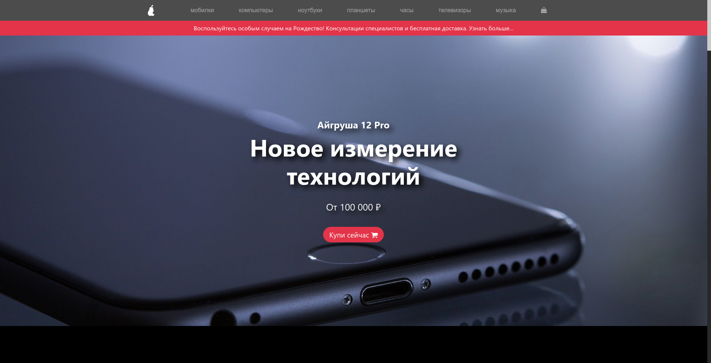
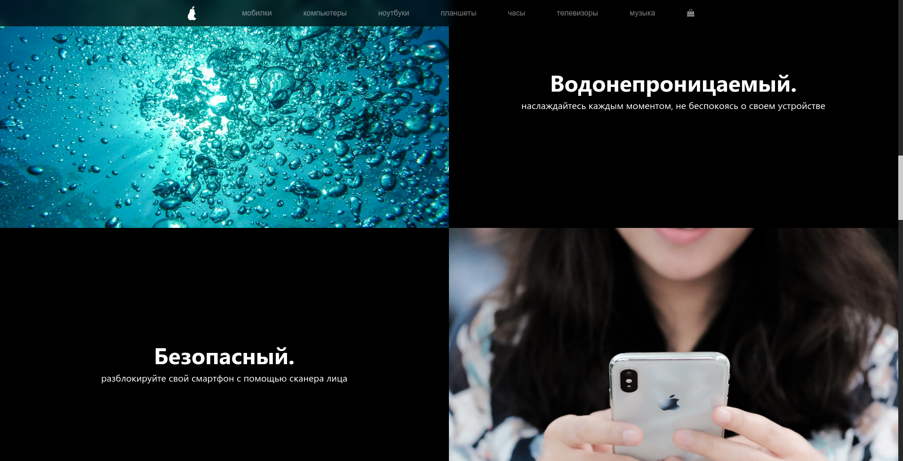
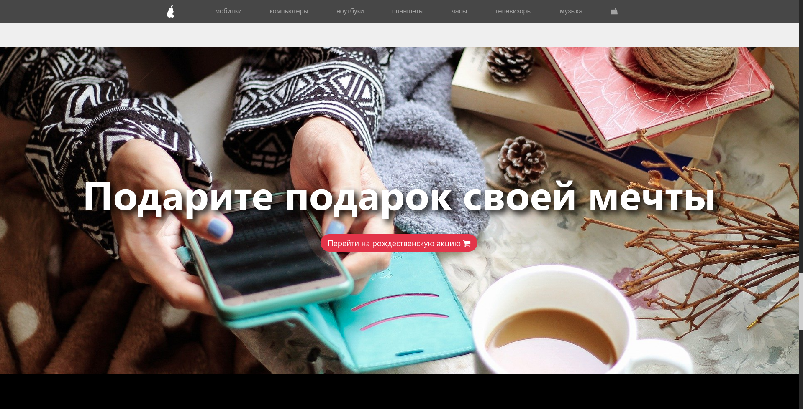
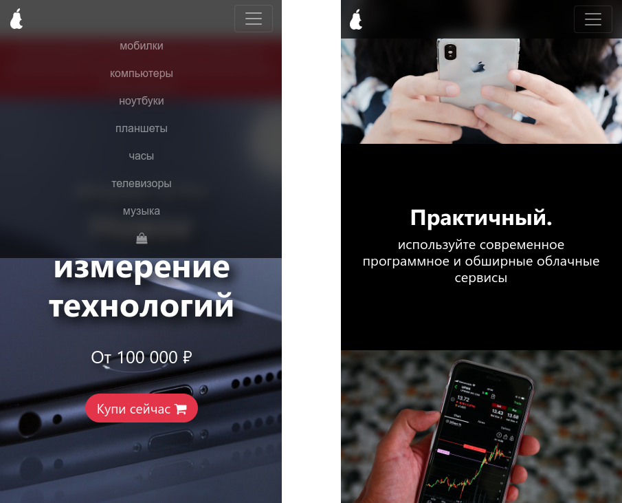

# Айгруша 12 Pro

      

Preview available [here](https://jakubpawlina.github.io/ajgrusza-landing-page/).

## Description
School project for Russian language lessons. Apple-style landing page design for a non-existent smartphone - Айгруша 12 Pro.

## Screenshots

